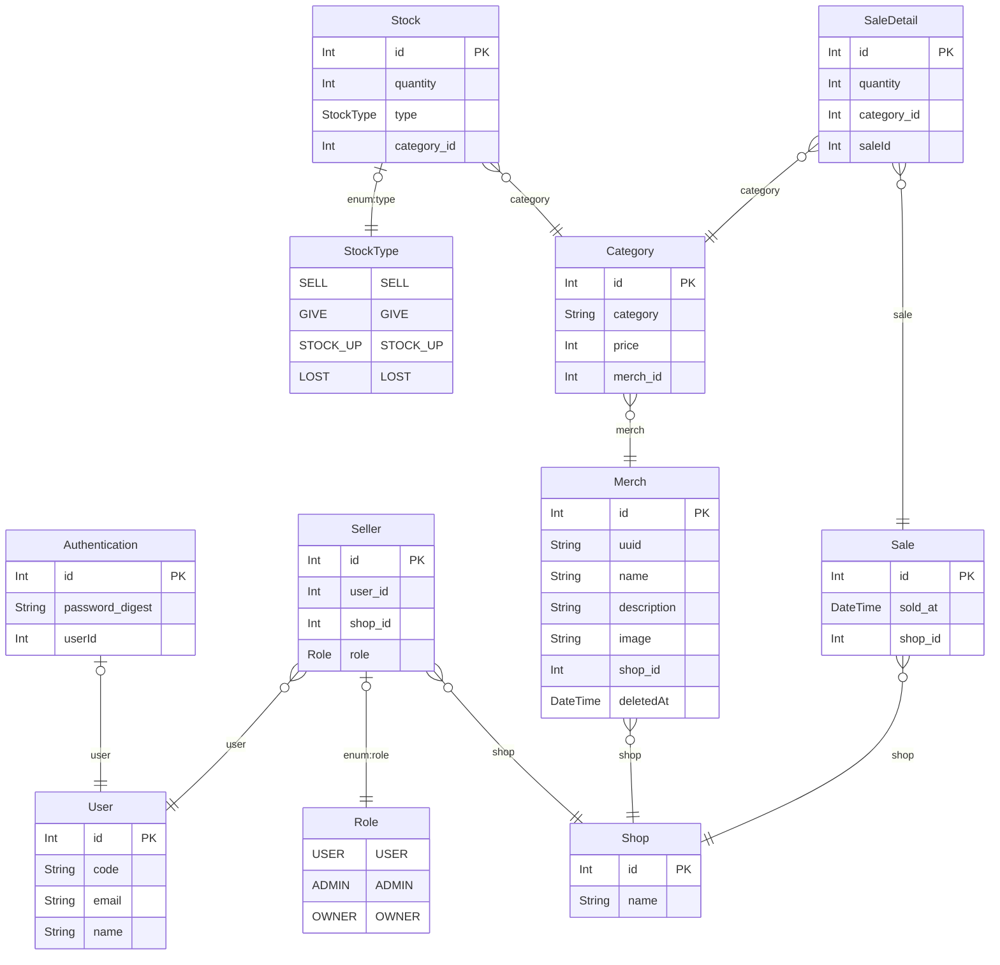

```mermaid
erDiagram

        Role {
            USER USER
ADMIN ADMIN
OWNER OWNER
        }
    


        StockType {
            SELL SELL
GIVE GIVE
STOCK_UP STOCK_UP
LOST LOST
        }
    
  User {
    Int id PK 
    String code  
    String email  
    String name  
    }
  

  Authentication {
    Int id PK 
    String password_digest  
    Int userId  
    }
  

  Shop {
    Int id PK 
    String name  
    }
  

  Seller {
    Int id PK 
    Int user_id  
    Int shop_id  
    Role role  
    }
  

  Merch {
    Int id PK 
    String uuid  
    String name  
    String description  
    String image  
    Int shop_id  
    DateTime deletedAt  
    }
  

  Category {
    Int id PK 
    String category  
    Int price  
    Int merch_id  
    }
  

  Stock {
    Int id PK 
    Int quantity  
    StockType type  
    Int category_id  
    }
  

  Sale {
    Int id PK 
    DateTime sold_at  
    Int shop_id  
    }
  

  SaleDetail {
    Int id PK 
    Int quantity  
    Int category_id  
    Int saleId  
    }
  
    Authentication o|--|| User : "user"
    Seller o|--|| Role : "enum:role"
    Seller o{--|| User : "user"
    Seller o{--|| Shop : "shop"
    Merch o{--|| Shop : "shop"
    Category o{--|| Merch : "merch"
    Stock o|--|| StockType : "enum:type"
    Stock o{--|| Category : "category"
    Sale o{--|| Shop : "shop"
    SaleDetail o{--|| Category : "category"
    SaleDetail o{--|| Sale : "sale"
```
