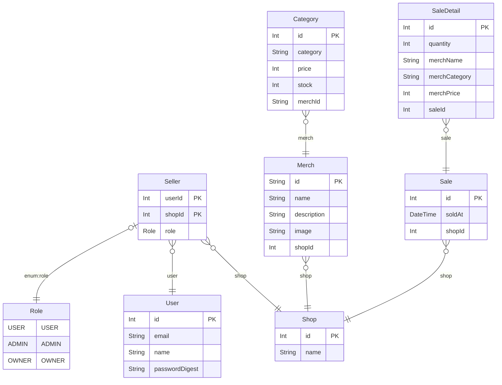

```mermaid
erDiagram

        Role {
            USER USER
ADMIN ADMIN
OWNER OWNER
        }
    
  User {
    Int id PK 
    String email  
    String name  
    String passwordDigest  
    }
  

  Shop {
    Int id PK 
    String name  
    }
  

  Seller {
    Int userId PK 
    Int shopId PK 
    Role role  
    }
  

  Merch {
    String id PK 
    String name  
    String description  
    String image  
    Int shopId  
    }
  

  Category {
    Int id PK 
    String category  
    Int price  
    Int stock  
    String merchId  
    }
  

  Sale {
    Int id PK 
    DateTime soldAt  
    Int shopId  
    }
  

  SaleDetail {
    Int id PK 
    Int quantity  
    String merchName  
    String merchCategory  
    Int merchPrice  
    Int saleId  
    }
  
    Seller o|--|| Role : "enum:role"
    Seller o{--|| User : "user"
    Seller o{--|| Shop : "shop"
    Merch o{--|| Shop : "shop"
    Category o{--|| Merch : "merch"
    Sale o{--|| Shop : "shop"
    SaleDetail o{--|| Sale : "sale"
```
